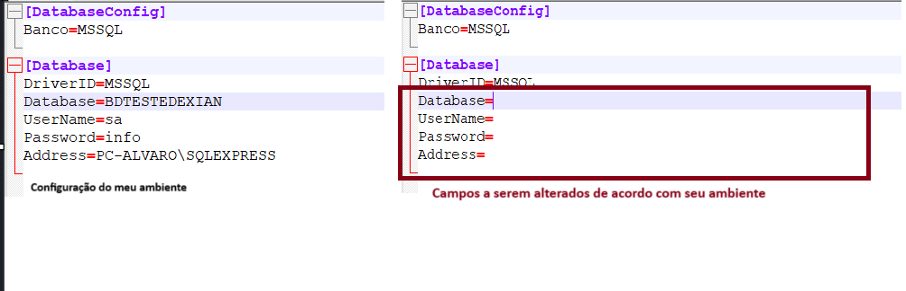

# Cadastro de Pedidos e Itens de Pedido

## Desafio técnico Delphi - Dexian

## Menu

- [Introdução](#introdução)
  
- [Configurações Iniciais](#configurações)

- [Arquitetura](#arquitetura)

- [Dicas de Uso](#dicas)

- [Padrões Aplicados](#padrões)

- [Boas Práticas](#boas)

## Introdução

Este projeto é uma aplicação Delphi, desenvolvida como forma de desafio técnico para o processo seletivo para uma vaga de programador Delphi. 
A aplicação permite a criação de cadastros de Clientes e Produtos, registra o movimento de pedidos, possibilitando a inclusão, alteração 
e exclusão de pedidos e seus respectivos itens,  além da pesquisas diversas e interativas, através de uma interface de pequisa, permitindo a navegação entre registros, exibindo ou atualizando os dados armazenados no banco de dados.

## Configurações

Para que seja possível a execução da aplicação, é necessário que seja criado um banco de dados SQL Server (bdTesteDeian), cujo script para criação do banco de dados (*Script Criação de Tabelas*), criação das tabelas utilizadas na aplicação e população de registros nas tabelas, encontra-se disponível dentro do projeto na pasta *Docs*. 

Na pasta do projeto, encontra-se o arquivo *testedexian.ini* contendo as informações necessárias para que a aplicação conecte com o banco de dados 
criado anteriormente. Também encontra-se na pasta do projeto o arquivo *Instrução para configuração do banco de dados a ser utilizado.pdf*, 
contendo todas as instruções para execução do script de criação das tabelas e configuração do arquivo *testedexian.ini".

*Arquivo testedexian.INI*

Com qualquer editor de arquivos TXT (ex: bloco de notas), é possível fazer as alterações no arquivo *testedexian.ini" para que seja possível realizar a conexão ao banco de dados e consequentemente, executar a apliacação sem erros.

# Arquitetura

A arquitetura do projeto segue o padrão MVC (Model-View-Controller), que promove uma separação clara de responsabilidades, facilitando a manutenção, escalabilidade e compreensão do código. Além disso, o projeto utiliza uma abordagem DAO (Data Access Object) para separar a lógica de acesso aos dados da lógica de negócios, garantindo maior modularidade e reutilização de código.

# Camadas do Projeto
### Model

Responsável por representar os dados e a lógica de negócios da aplicação.
Exemplos: cliente.model.pas, pedido.model.pas, produto.model.pas, pedidoitens.model.pas.

### View
Composta pelos formulários Delphi que interagem com o usuário.
Esses formulários lidam exclusivamente com a apresentação dos dados.
Exemplos: FrmMain, FrmCadVenda, ucadcliente.pas, ucadpedido.pas, ucadproduto.pas.

### Controller:

Realiza a comunicação entre o Model e a View.
Gerencia as regras de negócio e a lógica de interação do usuário.
Exemplos: cliente.controller.pas, pedido.controller.pas, produto.controller.pas, pedidoitens.controller.pas.

### DAO (Data Access Object):

Responsável por encapsular o acesso aos dados, separando a lógica de persistência da lógica de negócios.
Dividido em duas camadas principais: 

**Repository**: Contém as classes que realizam operações de CRUD (Create, Read, Update, Delete) diretamente no banco de dados.
Exemplos: cliente.repository.pas, pedido.repository.pas, produto.repository.pas, pedidoitens.repository.pas. 

**Service**: Contém as classes que implementam a lógica de negócios e fazem a ponte entre o Controller e o Repository.
Exemplos: cliente.service.pas, pedido.service.pas, produto.service.pas, pedidoitens.service.pas.

### Interface:

Contém as interfaces genéricas que definem contratos para as classes de Repository e Service.
Essas interfaces garantem que as classes que as implementam sigam um padrão comum, promovendo a reutilização de código e a flexibilidade.
Exemplos: 

**iinterface.repository.pas:** Define métodos comuns para operações de CRUD.
**iinterface.service.pas:** Define métodos comuns para a lógica de negócios.

### Util:

Contém classes utilitárias que fornecem funcionalidades comuns para todo o sistema.
Exemplos:
***conexao.pas:*** Gerencia a conexão com o banco de dados.
***cep.service.pas:*** Realiza consultas à API ViaCEP para obter informações de endereço a partir do CEP.
***untformat.pas:*** Contém funções para formatação de dados, como datas, valores monetários e strings.

### Docs:

Contém arquivos de configuração e documentação do projeto.
Inclui:
Arquivos de configuração do banco de dados (ex.: pharma.ini).
Scripts de criação do banco de dados e tabelas (ex.: criacao_tabelas.sql).

# Benefícios da Abordagem
### Separação de Responsabilidades:
Cada camada (Model, View, Controller, DAO, Util) tem uma responsabilidade clara, o que facilita a manutenção e a escalabilidade do código.

### Reutilização de Código:

As interfaces genéricas (iinterface.repository.pas e iinterface.service.pas) permitem que as classes que as implementam sigam um padrão comum, promovendo a reutilização de código.

As classes utilitárias (util) centralizam funcionalidades comuns, evitando duplicação de código.

### Facilidade de Testes:

A separação entre a lógica de negócios e o acesso aos dados facilita a criação de testes unitários e a simulação de cenários.

### Legibilidade e Organização:

A estrutura modular e bem organizada torna o código mais legível e fácil de entender, especialmente para novos desenvolvedores que entram no projeto.

Configuração e Documentação:

A pasta docs centraliza arquivos de configuração e scripts de banco de dados, facilitando a implantação e a manutenção do sistema.

Essa abordagem garante a separação das camadas e melhora a legibilidade do código.

## Design Patterns
O projeto implementa diversos padrões de design que reforçam a flexibilidade e a organização do código:

**Singleton**: Utilizado para a classe TConnection, garantindo uma única instância de conexão com o banco de dados, reduzindo a sobrecarga de recursos.

**Repository**: Responsável pelas operações de persistência no banco de dados, como demonstrado na classe pedido.repository.
Service: Centraliza a lógica de negócios mais complexa, como na classe pedido.service, que encapsula operações que não estão diretamente ligadas à camada de apresentação.

## Princípios SOLID
Os princípios SOLID foram aplicados para promover um design robusto e de fácil manutenção:

**Single Responsibility Principle (SRP)**: Cada classe tem uma responsabilidade única e bem definida. Por exemplo, a cliente.repository lida apenas com operações no banco relacionadas ao cliente.
Open/Closed Principle (OCP): O sistema foi projetado para ser aberto para extensões (novas funcionalidades), mas fechado para alterações nas partes existentes.

**Liskov Substitution Principle (LSP)**: Interfaces como IRepository garantem que diferentes implementações possam ser substituídas sem alterar o comportamento esperado.

**Interface Segregation Principle (ISP)**: Interfaces pequenas e específicas foram criadas para evitar dependências desnecessárias, como IPedidoService e IPedidoRepository.

**Dependency Inversion Principle (DIP)**: A aplicação desacopla dependências diretas entre camadas utilizando injeção de dependência e abstrações, como o uso de interfaces.

## Boas Práticas

- **Clean Code**: O código foi escrito seguindo princípios de clean code, com nomes de variáveis e métodos claros, funções curtas e bem definidas.

- **Tratamento de Erros**: Implementação de mensagens amigáveis ao usuário para tratamento de erros e validação de dados.

- **Uso de Tabelas Temporárias**: Utilização de tabelas temporárias para armazenar dados intermediários durante as operações de consulta.

## Dicas de Uso

A interface principal da aplicação é apresentada contendo os botões de opções (Clientes, Produtos, Pedidos, Relatórios e Sair), Através dessa interface que serão abertas as telas de uso da aplicação. 

## Cadastro de Clientes

Na interface principal, ao clicar no botão **"Clientes"**, será exibida a interface de clientes, contendo os dados do cliente, uma grade contendo todos os clientes cadastrados, uma área para pesquisa no grid (podendo ser alterada a forma de pesquisa por nome do cliente ou cidade), além dos botões de ação (Incluir, Alterar, Excluir, Gravar, Cancelar e Sair), localizados acima da tela.

Para selecionar um registro da grade, basta dar um duplo click no registro escolhido, que todas as informações do cliente serão mostradas na área destinada aos dados do cliente. Pode-se também, navegar pela grade usando as setas e ao acionar a tecla *Enter* o registro será exibido na área de dados do produto, ja em estado de edição.

- **Botão Inserir:** Ao clicar no botão "**Inserir**", será liberada a área de dados do cliente para a digitação das informações para a inclusão de um novo cliente. Nesse momento, os botoes "**Gravar**" e "**Cancelar**" ficam habilitados e os demais botões ficam desabilitados, ficando para o usuário as opções de gravar o produto ou cancelar a inclusão.

- **Botão Alterar**: Após selecionar um registo na grade, fica habilitado o botão "**Alterar**". Ao clicar no botão "**Alterar**", será liberada a área de dados do cliente para a alteração das informações referentes ao cliemte. Nesse momento, os botoes "**Gravar**" e "**Cancelar**" ficam habilitados e os demais botões ficam desabilitados, ficando para o usuário as opções de gravar o produto ou cancelar a alteração.

- **Botão Excluir**: Após selecionar um registo na grade, fica habilitado o botão "**Excluir**". Ao clicar no botão "**Excluir**", será feita uma pergunta ao usuario se ele deseja excluir o registro selecionado. Caso o usuário responda "Sim", o registro será excluído definitivamente do cadastro de clientes.

- **Botão Sair:** Fecha a tela do cadastro de produtos e retorna ao menu inicial.

### Cadastro de Produtos

Segue o mesmo padrão de uso do cadastro de clientes, podendo realizar as mesmas operações 

## Cadastro de Pedidos

Na interface principal, ao clicar no botão **"Pedidos"**, será exibida a interface de pedidos contendo os dados do pedido e uma grade para os produtos cadastrados, além dos botões de ação (Incluir, Alterar, Excluir, Gravar, Cancelar e Sair), localizados acima da tela.

Para acessar um pedido cadastrado o usuário pode informar o codigo da venda no campo apropriado e em seguida clicar no botão "**Pesquisar**".

Caso o usuário deseje fazer uma pesquisa de todas as vendas cadastradas, basta clicar no botão pesquisar e será exibida uma tela contendo todas os pedidos cadastrados para que o usuário escolha o pedido desejado.

Para selecionar um registro, o usuário pode clicar no botão "**Selecionar**" , pode dar um duplo click no registro desejado ou navegar pelo grid usando as setas e acionar a tecla *Enter* para selecionar um registro, nesse caso, o resgistro será exibido, já estando em modo de edição. A pesquisa pode ser refinada, escolhendo o filtro para a pesquisa e informando um valor para pesquisa, valor esse que pode ser parte da informação ou a informação completa.

Os botões de ação seguem o mesmo comportamento dos botões de ação da tela de produtos/clientes/entregadores, explanados anteriormente.

Para a inclusão de pedidos, seguir os passos abaixo:

Clicar no botão **Inserir** para liberar a digitação dos dados do pedido.

Após preencher os dados do pedido, **Inserir Itens**  para liberar a inclusão dos itens do pedido.

Escolha o produto, informe a quantidade, o preço unitário (caso exista valor informado no cadastro para o produto escolhido, o campo "*Preço Unitário**" será preenchido automaticamente, podendo o mesmo ser alterado de acordo com o desejo do usuário) e o preço total do item.

Clique no botão **Adicionar Produto**  no pedido e o mesmo ir para a grade de produtos cadastrados.

Caso deseje excluir um produto cadastrado, clique no **Deletar Item**   para exluir o produto da grade de produtos cadastrados.

Após incluir os itens desejados, clicar no botão **Gravar** para realizar a inclusão do pedido.

## Relatórios

Nessa tela será mostrado todos os pedidos cadastrados no sistema. Poderá ser feito também pequisa por intervalo de datas, bastanto para isso, informar o periódo desejado.

Para todas as informações de um pedido específico, basta dar um duplo click ou enter no registro selecionado, e serão mostrados todos os dados do pedido.

